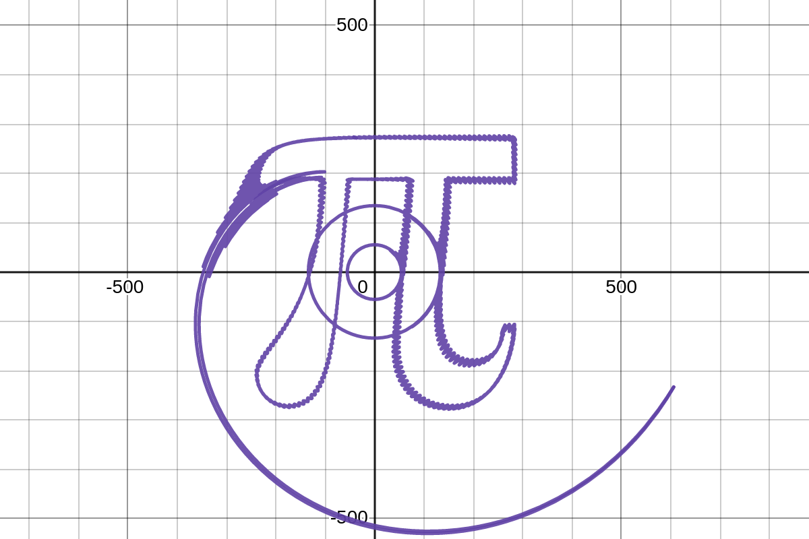

## fourier-image

> generate fourier series from images. (in other words, get the equation to an epicycle)

### usage

#### preprocessing/conversion to svg
  - **this is only necessary if starting with a bitmap image.**
  - `python3 transform/preprocess.py -i <image>` will run some preprocessing on the image.
  - then use a program like [inkscape](https://inkscape.org/) and trace the bitmap.

#### generating point data
  - **note: point data will only be generated for `<path>` elements, do check if your svg is completely comprised of `<path>` elements first.**
  - once you have an svg, copy the svg file contents.
  - run the website using `npm run dev` and paste the file contents into the text box.
  - this should create a preview of your svg, if it looks correct, press `calculate`.
  - when it finishes calculating, press `copy` and the point data will be saved to your clipboard.

#### calculating
  - create a `json` file with the point data on your clipboard.
  - `python3 transform/main.py -i <data>` will generate a text file containing the equations in LaTeX format.
